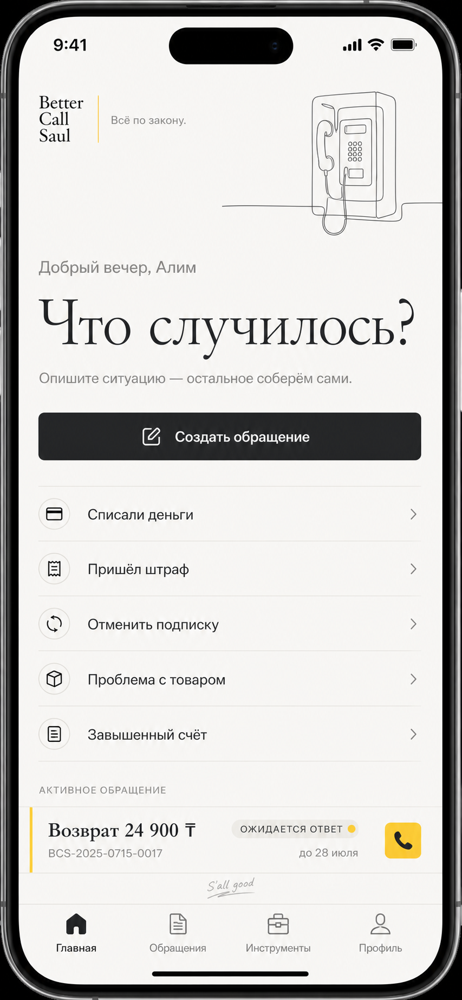
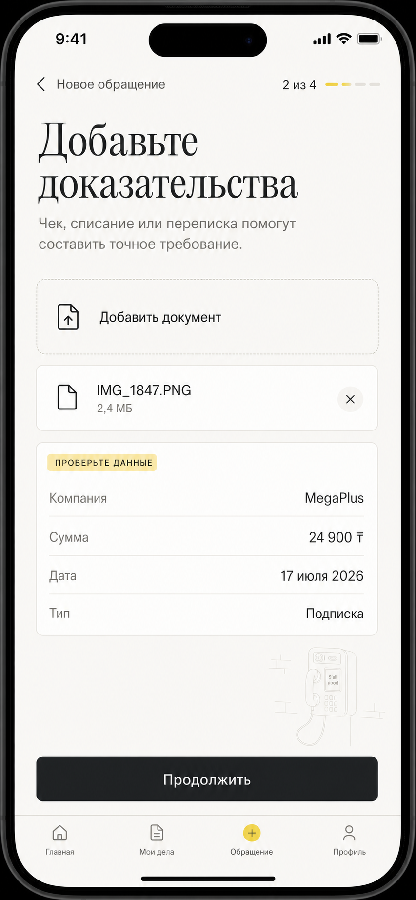
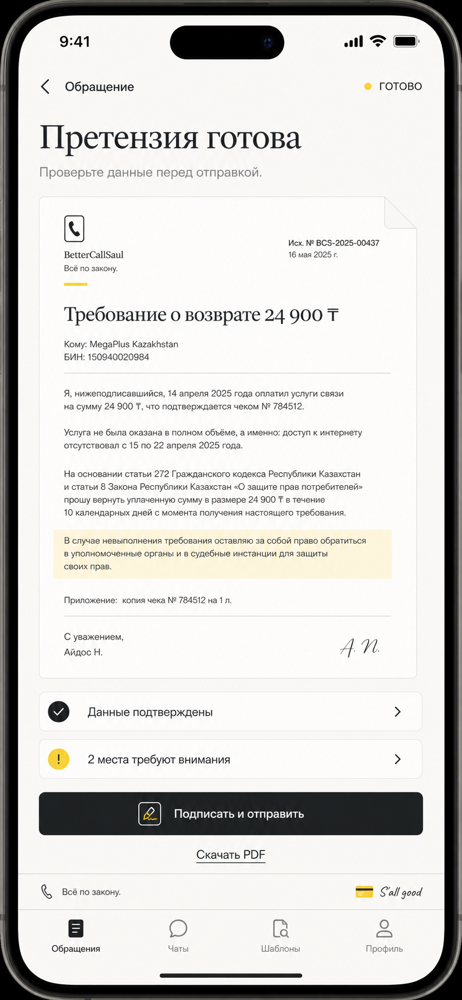
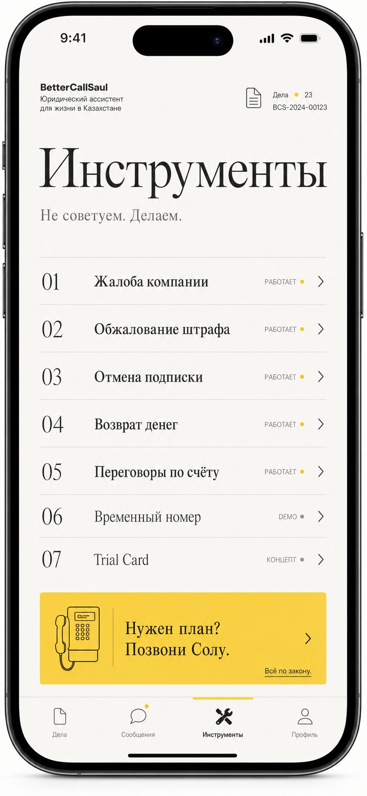
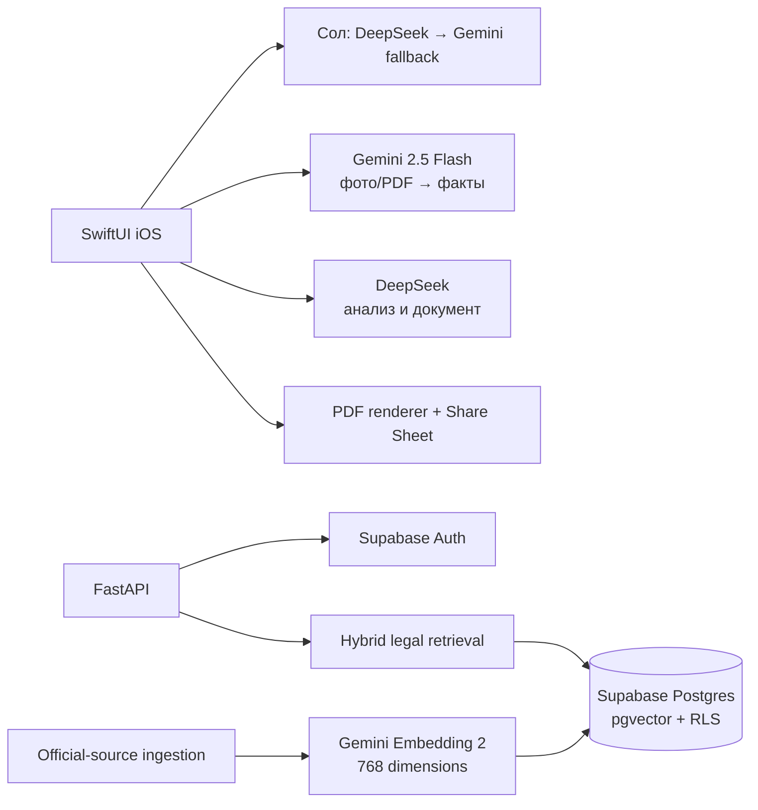

# BetterCallSaul

> Онлайн-адвокат для Казахстана, который превращает проблему пользователя в проверяемые факты, юридическое обращение и готовый PDF.

BetterCallSaul — нативное iOS-приложение для типовых потребительских и административных ситуаций. Пользователь описывает проблему, прикладывает чек, скриншот или PDF, подтверждает распознанные данные и получает структурированную претензию.

[Скачать готовый Simulator-билд и посмотреть демо](https://github.com/Lyamon4/BetterCallSoul/releases/latest)

## Что работает

| Возможность | Статус | Что делает |
| --- | --- | --- |
| Жалобы и требования | Работает | Формирует официальную претензию компании или организации |
| Обжалование штрафов | Работает | Собирает обстоятельства и создаёт проект апелляции |
| Отмена подписок | Работает | Готовит требование об отмене и возврате спорного списания |
| Возвраты и компенсации | Работает | Обрабатывает некачественный товар, ошибочное списание и нарушение гарантии |
| Переговоры по счетам | Работает | Создаёт требование о проверке начислений и перерасчёте |
| Сол — AI-маршрутизатор | Работает | Понимает проблему своими словами и открывает нужный сценарий |
| Анализ фото и PDF | Работает | Gemini 2.5 Flash извлекает только видимые факты |
| Юридическая генерация | Работает | DeepSeek создаёт полноценную структуру претензии |
| Экспорт PDF | Работает | Рендерит документ и открывает системное меню отправки |
| Временный номер | Demo | Демонстрация будущего пользовательского сценария |
| Trial Card | Концепт | Концепция виртуальной карты для безопасного trial-периода |
| Автоотправка писем и факсов | Roadmap | Требует внешней почтовой/факсовой интеграции |

## Пользовательский сценарий

1. Пользователь выбирает категорию или рассказывает проблему Солу.
2. DeepSeek классифицирует ситуацию; Gemini используется как fallback маршрутизатора.
3. Пользователь загружает фотографию, скриншот или PDF.
4. Gemini 2.5 Flash извлекает компанию, сумму, дату, тип документа и исходный текст.
5. Пользователь проверяет и редактирует распознанные поля.
6. DeepSeek получает только подтверждённый текст и создаёт разделы претензии.
7. Ready gate не считает документ готовым, пока обязательные поля требуют внимания.
8. Приложение создаёт PDF, который можно сохранить или отправить.

## Интерфейс

| Главная | Доказательства |
| --- | --- |
|  |  |

| Готовый документ | Инструменты |
| --- | --- |
|  |  |

## Архитектура



### iOS

- SwiftUI, iOS 17+;
- отдельные workflow для пяти категорий;
- DeepSeek для классификации проблемы и юридического текста;
- Gemini 2.5 Flash для изображений и fallback-классификации;
- редактируемые извлечённые поля;
- генерация и системная отправка PDF;
- unit- и UI-тесты основных сценариев.

### Backend и RAG

- FastAPI и Python 3.12;
- Supabase JWT verification;
- закрытая схема `rag`;
- Postgres full-text search + pgvector + RRF;
- Gemini Embedding 2, размерность 768;
- версионирование официальных источников;
- staged/active revisions и атомарный activation gate;
- возобновляемая ingestion pipeline при исчерпании квоты;
- проверочная выборка из десяти retrieval-сценариев.

В текущем hackathon demo-flow мобильное приложение обращается к Gemini и DeepSeek напрямую. Backend содержит защищённую основу авторизации, загрузки официального корпуса и retrieval. Для production ключи AI должны находиться только на backend, а мобильный клиент должен обращаться к нему через авторизованный API.

## Структура репозитория

```text
.
├── ios/                     # SwiftUI-приложение, тесты и XcodeGen-конфигурация
├── backend/                 # FastAPI, ingestion и retrieval
├── supabase/                # SQL-миграции, RLS и проверки RAG
├── design-concepts/         # Актуальные UI-мокапы
└── docs/                    # Архитектурные спецификации и планы реализации
```

## Быстрый запуск iOS

### Требования

- macOS;
- Xcode с установленным iOS Simulator;
- [XcodeGen](https://github.com/yonaskolb/XcodeGen).

### Настройка

```bash
git clone https://github.com/Lyamon4/BetterCallSoul.git
cd BetterCallSoul/ios
```

Приватный hackathon-репозиторий уже содержит `Config/Secrets.local.xcconfig`
с конфигурацией Gemini 2.5 Flash и DeepSeek V4 Pro. Для запуска iOS-приложения
вводить AI-ключи вручную не нужно.

Сгенерируйте Xcode-проект и откройте его:

```bash
xcodegen generate
open BetterCallSaul.xcodeproj
```

В Xcode выберите iPhone Simulator и запустите схему `BetterCallSaul`.

### Запуск из терминала

```bash
cd ios
xcodegen generate

xcodebuild \
  -project BetterCallSaul.xcodeproj \
  -scheme BetterCallSaul \
  -destination 'platform=iOS Simulator,name=iPhone 17 Pro' \
  build
```

## Установка готового Simulator-билда

1. Откройте [последний GitHub Release](https://github.com/Lyamon4/BetterCallSoul/releases/latest).
2. Скачайте `BetterCallSaul-Simulator-Demo.app.zip`.
3. Распакуйте архив.
4. Запустите нужный iPhone Simulator.
5. Выполните:

```bash
xcrun simctl install booted BetterCallSaul.app
xcrun simctl launch booted kz.techvision.bettercallsaul
```

Simulator-билд работает только на Mac с установленным Xcode. Для установки на физический iPhone требуется Apple Developer signing и отдельный `.ipa`.

## Запуск backend

Требуются `uv` и Python 3.12. Полный dependency graph закреплён в `backend/uv.lock`.

```bash
cd backend
uv sync --python 3.12
cp .env.example .env
uv run uvicorn bettercallsaul_api.main:app --reload
```

Переменные окружения:

```dotenv
ENVIRONMENT=development
SUPABASE_URL=
SUPABASE_PUBLISHABLE_KEY=
SUPABASE_SECRET_KEY=
GEMINI_API_KEY=
GEMINI_EMBEDDING_MODEL=gemini-embedding-2
GEMINI_EMBEDDING_DIMENSIONS=768
```

`SUPABASE_SECRET_KEY` — только для backend. Не добавляйте его в iOS-конфигурацию.

Доступные endpoints основы API:

- `GET /health` — health check без авторизации;
- `GET /v1/me` — проверка Supabase Bearer token.

## Загрузка официального правового корпуса

Registry принимает только проверенные коды источников Adilet, eGov и gov.kz. Произвольный URL передать нельзя.

Dry run без Gemini и записи в Supabase:

```bash
cd backend
uv run bettercallsaul-ingest --all --dry-run
```

Создание staged revision:

```bash
uv run bettercallsaul-ingest --source consumer_protection_law
```

Активация проверенной редакции:

```bash
uv run bettercallsaul-ingest --source consumer_protection_law --activate
```

Retrieval evaluation:

```bash
uv run bettercallsaul-evaluate --match-count 10
```

## Supabase

Миграции применяются по порядку:

1. `20260720170000_rag_foundation.sql`
2. `20260720171000_hybrid_legal_search.sql`
3. `20260720204758_legal_ingestion_rpc.sql`
4. `20260720220000_resumable_legal_ingestion.sql`

Пользовательские таблицы защищены owner-based RLS. Правовой корпус хранится в закрытой схеме `rag`; доступ для `PUBLIC`, `anon` и `authenticated` отозван. Security-definer RPC доступны только `service_role`.

Проверка схемы находится в `supabase/tests/rag_foundation.sql`. Она запускается внутри транзакции и откатывает изменения.

## Тесты

### iOS

```bash
cd ios
xcodegen generate

xcodebuild test \
  -project BetterCallSaul.xcodeproj \
  -scheme BetterCallSaul \
  -destination 'platform=iOS Simulator,name=iPhone 17 Pro'
```

### Backend

```bash
cd backend
uv sync --python 3.12
uv run pytest -q
uv run pytest --cov=bettercallsaul_api --cov-report=term-missing -q
```

## Приватность и безопасность

- Исходные фотографии и PDF не добавляются в RAG-корпус.
- DeepSeek получает подтверждённый пользователем текст, а не бинарные файлы.
- Неуверенные распознанные значения остаются редактируемыми.
- Ключи и `.env` исключены из Git.
- Backend service-role key никогда не должен попадать в приложение.
- Demo-билд с клиентскими AI keys нельзя публиковать как production-приложение.

## Ограничения hackathon-версии

- AI-flow зависит от доступности и квот Gemini/DeepSeek.
- Готовый артефакт предназначен для iOS Simulator.
- Временный номер и Trial Card являются демонстрацией/концептом.
- Автоматическая физическая отправка писем, факсов и трекинг ответа требуют внешних интеграций.
- Приложение помогает подготовить обращение, но не заменяет лицензированного юриста.

## Правовой дисклеймер

BetterCallSaul — технический прототип для Tech Vision 2026. Сгенерированные документы необходимо проверять перед отправкой. Проект не предоставляет юридическое представительство и не гарантирует исход спора.
